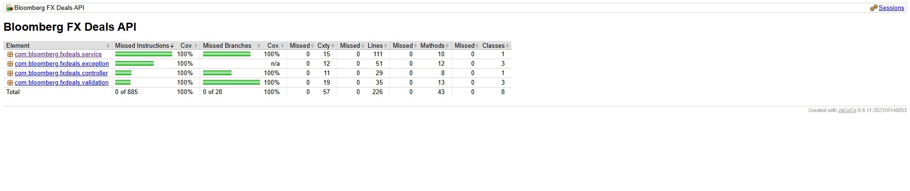

# Bloomberg FX Deals API

A production-ready Spring Boot REST API for processing and managing Foreign Exchange (FX) deals with comprehensive testing, validation, and performance monitoring.

---

## 📋 Table of Contents

- [Overview](#overview)
- [Technology Stack](#technology-stack)
- [Prerequisites](#prerequisites)
- [Getting Started](#getting-started)
- [API Endpoints](#api-endpoints)
- [Architecture & Design](#architecture--design)
- [Testing Strategy](#testing-strategy)
- [Performance Testing](#performance-testing)
- [Data Validation](#data-validation)
- [Database Schema](#database-schema)
- [Project Structure](#project-structure)
- [Build & Deployment](#build--deployment)

---

## 🎯 Overview

This system accepts FX deal details from various sources and persists them into a database with the following guarantees:

- **No Duplicate Deals**: Each deal is uniquely identified and duplicates are rejected
- **Comprehensive Validation**: All fields are validated with proper error handling
- **Audit Trail**: All deals are timestamped with creation time for audit purposes
- **Batch Processing**: Support for importing multiple deals with no-rollback behavior
- **Production-Ready**: Includes containerization, monitoring, and comprehensive testing

---

## 🛠 Technology Stack

### Core Technologies

| Technology | Version | Purpose |
|------------|--------|---------|
| **Java** | 21     | Runtime environment (LTS version) |
| **Spring Boot** | 3.3.5  | Application framework |
| **Maven** | 4.OO   | Build tool & dependency management |
| **PostgreSQL** | 16     | Production database |
| **Docker** | Latest | Containerization |
| **Docker Compose** | Latest | Multi-container orchestration |

### Testing & Quality

| Tool | Purpose |
|------|---------|
| **JUnit 5** | Unit testing framework |
| **Mockito** | Mocking framework for unit tests |
| **REST Assured** | API integration testing |
| **JaCoCo** | Code coverage analysis (100% required) |
| **K6** | Performance & load testing |
| **Postman** | Manual API testing & documentation |

---

## 📦 Prerequisites

Ensure you have the following installed:
```bash
# Java 21
java -version
# openjdk version "21.0.x"

# Maven 4.0.O
mvn -version
# Apache Maven 3.9.11

# Docker & Docker Compose
docker --version
docker compose version

# K6 (for performance testing)
k6 version
# k6 v0.48.0
```

---

## 🚀 Getting Started

### Quick Start with Make
```bash
# Clone the repository
git clone https://github.com/hamzabla/bloomberg-fx-api.git
cd bloomberg-fx-api

# View all available commands
make help

# Install dependencies
make install

# Run tests
make test

# Start the application with Docker
make up

# Or run locally (PostgreSQL only in Docker)
make run-local
```

### Manual Setup
```bash
# 1. Install dependencies
mvn clean install

# 2. Start PostgreSQL
docker compose up postgres -d

# 3. Run the application
mvn spring-boot:run

# 4. Access the API
curl http://localhost:8080/api/deals/health
```

---

## 🔌 API Endpoints

### Health Check
```http
GET /api/deals/health
```
Returns system health status.

### Create Single Deal
```http
POST /api/deals
Content-Type: application/json

{
  "dealUniqueId": "DEAL-2024-001",
  "fromCurrencyCode": "USD",
  "toCurrencyCode": "EUR",
  "dealTimestamp": "2024-11-14T10:30:00Z",
  "dealAmount": 1000.50
}
```

**Response (201 Created):**
```json
{
  "id": 1,
  "dealUniqueId": "DEAL-2024-001",
  "fromCurrencyCode": "USD",
  "toCurrencyCode": "EUR",
  "dealTimestamp": "2024-11-14T10:30:00Z",
  "dealAmount": 1000.50,
  "createdAt": "2024-11-14T10:30:01Z"
}
```

### Batch Import Deals
```http
POST /api/deals/batch
Content-Type: application/json

{
  "deals": [
    {
      "dealUniqueId": "DEAL-2024-001",
      "fromCurrencyCode": "USD",
      "toCurrencyCode": "EUR",
      "dealTimestamp": "2024-11-14T10:30:00Z",
      "dealAmount": 1000.50
    },
    {
      "dealUniqueId": "DEAL-2024-002",
      "fromCurrencyCode": "GBP",
      "toCurrencyCode": "JPY",
      "dealTimestamp": "2024-11-14T11:00:00Z",
      "dealAmount": 2500.75
    }
  ]
}
```

**Response (207 Multi-Status):**
```json
{
  "totalRequests": 2,
  "successfulImports": 1,
  "failedImports": 1,
  "successfulDeals": [
    {
      "id": 1,
      "dealUniqueId": "DEAL-2024-001",
      "fromCurrencyCode": "USD",
      "toCurrencyCode": "EUR",
      "dealTimestamp": "2024-11-14T10:30:00Z",
      "dealAmount": 1000.50,
      "createdAt": "2024-11-14T10:30:01Z"
    }
  ],
  "failedDeals": [
    {
      "dealUniqueId": "DEAL-2024-002",
      "reason": "Duplicate: Deal with unique ID already exists",
      "originalRequest": {
        "dealUniqueId": "DEAL-2024-002",
        "fromCurrencyCode": "GBP",
        "toCurrencyCode": "JPY",
        "dealTimestamp": "2024-11-14T11:00:00Z",
        "dealAmount": 2500.75
      }
    }
  ]
}
```

**Key Feature**: Batch import uses **NO ROLLBACK** 
strategy - valid deals are saved even if some deals fail validation or are duplicates.

### Get All Deals
```http
GET /api/deals
```

### Get Deal by ID
```http
GET /api/deals/{id}
```

### Get Deal by Unique ID
```http
GET /api/deals/unique/{dealUniqueId}
```

---

## 🏗 Architecture & Design


### Key Components

**1. Controllers** (`com.bloomberg.fxdeals.controller`)
- Handle HTTP requests/responses
- Input validation coordination
- HTTP status code management
- Error response formatting

**2. Services** (`com.bloomberg.fxdeals.service`)
- Business logic implementation
- Deal uniqueness validation
- Currency validation
- Batch processing with independent transaction handling

**3. Repositories** (`com.bloomberg.fxdeals.repository`)
- JPA data access
- Custom query methods
- Database interaction abstraction

**4. Validation Layer** (`com.bloomberg.fxdeals.validation`)
- Custom validators (e.g., `@ValidCurrencyCode`)
- Bean validation integration
- Batch structure validation
- Separation of validation logic from business logic

**5. Exception Handling** (`com.bloomberg.fxdeals.exception`)
- Global exception handler with `@ControllerAdvice`
- Custom exceptions:
    - `DuplicateDealException`: When deal unique ID already exists
    - `DealNotFoundException`: When querying non-existent deals
    - `InvalidCurrencyException`: When currency code is invalid

### Design Patterns Used

- **DTO Pattern**: Separate request/response objects from domain entities
- **Repository Pattern**: Abstract data access layer
- **Builder Pattern**: Clean object construction (Lombok `@Builder`)
- **Strategy Pattern**: Validation strategy separation
- **Exception Handling Pattern**: Centralized error handling

---

## 🧪 Testing Strategy

### Running Specific Test Suites
```bash
# Run only unit tests
make test-unit
# Report: target/site/jacoco/index.html

# Run only integration tests
make test-integration
# Report: target/site/jacoco-it/index.html

# Run only REST Assured API tests
make test-api


# Run all tests with separate coverage reports
make test
# Reports:
#   - Unit:        target/site/jacoco/index.html
#   - Integration: target/site/jacoco-it/index.html  
#   - Merged:      target/reporting/jacoco-merged/index.html

# View all coverage reports in browser
make coverage-view
```

### 1. Unit Tests (`src/test/java/.../unit/`)

**Purpose**: Test individual components in isolation with mocked dependencies.

**What They Test**:
- **FxDealServiceTest**: Business logic
    - Deal creation with valid data
    - Duplicate detection
    - Same currency rejection
    - Currency code normalization (uppercase conversion)
    - Batch processing logic
    - Error handling

- **FxDealBatchValidatorTest**: Validation logic
    - Individual deal validation
    - Batch structure validation
    - Multiple validation errors
    - Validation result creation

**Example**:
```java
@Test
void createDeal_WithDuplicateId_ShouldThrowException() {
    when(fxDealRepository.existsByDealUniqueId(anyString())).thenReturn(true);
    
    assertThrows(DuplicateDealException.class, () -> {
        fxDealService.createDeal(validRequest);
    });
    
    verify(fxDealRepository, never()).save(any(FxDeal.class));
}
```

---

### 2. Integration Tests (`src/test/java/.../integration/`)

**Purpose**: Test component interactions with real database.

**Why We Need Them** (Differences from Unit Tests):

| Aspect | Unit Tests | Integration Tests |
|--------|------------|-------------------|
| **Database** | Mocked repository | Real PostgreSQL (Testcontainers) |
| **Transactions** | Not tested | Tested with @Transactional |
| **Data Persistence** | Not verified | Actual save/retrieve verified |
| **Constraints** | Not enforced | Database constraints enforced |
| **Query Behavior** | Not tested | Actual JPA queries tested |

**What They Test**:
- **FxDealIntegrationTest**:
    - Actual database persistence
    - Unique constraint enforcement
    - Transaction rollback behavior
    - JPA relationship mapping
    - Custom repository queries

- **FxDealBatchIntegrationTest**:
    - Batch persistence with real DB
    - **NO ROLLBACK verification** (critical requirement!)
    - Partial success scenarios
    - Database constraint violations during batch
    - Concurrent batch processing

**Example** (Critical NO ROLLBACK test):
```java
@Test
void importBatch_PartialSuccess_VerifiesNoRollback() {
    // Mix of: valid, invalid, valid
    List<FxDealRequest> deals = Arrays.asList(
        createValidDeal("NO-ROLLBACK-001"),   // ✓ Should save
        createInvalidDeal("NO-ROLLBACK-002"), // ✗ Should fail
        createValidDeal("NO-ROLLBACK-003")    // ✓ Should save
    );
    
    FxDealBatchResponse response = fxDealService.importBatch(batchRequest);
    
    // CRITICAL: Both valid deals MUST be in database
    // even though one deal in the middle failed!
    List<FxDeal> savedDeals = fxDealRepository.findAll();
    assertEquals(2, savedDeals.size());
    assertTrue(fxDealRepository.existsByDealUniqueId("NO-ROLLBACK-001"));
    assertTrue(fxDealRepository.existsByDealUniqueId("NO-ROLLBACK-003"));
}
```

---

### 3. API Tests with REST Assured (`src/test/java/.../api/`)

**Purpose**: Test complete HTTP request/response cycle.

**What They Test**:
- **FxDealApiTest**: Single deal endpoints
    - HTTP status codes
    - Request/response JSON structure
    - Content-Type headers
    - Error response format

- **FxDealBatchApiTest**: Batch import endpoints
    - Batch request validation
    - Multi-status responses (207)
    - Partial success handling
    - Error aggregation

**Example**:
```java
@Test
void importBatch_WithMixedValidAndInvalid_ShouldReturn207() {
    FxDealBatchRequest batchRequest = createMixedBatch();
    
    given()
        .contentType(ContentType.JSON)
        .body(batchRequest)
    .when()
        .post("/batch")
    .then()
        .statusCode(207)  // Multi-Status
        .body("totalRequests", equalTo(3))
        .body("successfulImports", equalTo(2))
        .body("failedImports", equalTo(1));
}
```

---

### Test Coverage Requirements

**JaCoCo Configuration** (enforced at build time):
- **Instruction Coverage**: 100%
- **Branch Coverage**: 100%
- **Line Coverage**: 100%
```bash
# Run tests with coverage
make test

# View coverage report
make coverage
# Opens: target/site/jacoco/index.html
```

---

## ⚡ Performance Testing

### K6 Load Testing

**Tool**: Grafana K6 - Modern load testing tool for APIs

**Test File**: `k6/load-test.js`

**Test Scenarios**:

1. **Single Deal Imports** (10 concurrent users)
    - Tests individual deal creation
    - Target: p95 response time < 1 second
    - Simulates real-world single transaction load

2. **Batch Imports** (3 concurrent users, 20 deals/batch)
    - Tests batch processing performance
    - Target: p95 response time < 3 seconds
    - Validates NO ROLLBACK performance
    - Simulates bulk import scenarios

**Running Performance Tests**:
```bash
# Ensure application is running
make run-local

# In another terminal:
make k6-load
```

**Expected Results**:
```
scenarios: (100.00%) 2 scenarios, 13 max VUs

✓ single deal: status is 201
✓ single deal: response time < 1s
✓ batch import: status is 201 or 207
✓ batch import: has successful imports
✓ batch import: success rate > 90%

checks.........................: 99.93%  ✓ 2966      ✗ 2
http_req_duration..............: avg=15.63ms  p(95)=890ms  max=2.1s
http_reqs......................: 914    8.290586/s
```

**Performance Thresholds**:
- Single deal creation: < 1s (p95)
- Batch import (20 deals): < 3s (p95)
- Error rate: < 10%
- Success rate: > 95%

---

## ✅ Data Validation

### Field Validations

| Field | Validation Rules |
|-------|------------------|
| **dealUniqueId** | Required, not blank, must be unique |
| **fromCurrencyCode** | Required, valid ISO 4217 code (3 letters) |
| **toCurrencyCode** | Required, valid ISO 4217 code (3 letters) |
| **dealTimestamp** | Required, valid ISO-8601 timestamp |
| **dealAmount** | Required, must be > 0 |

### Business Rules

1. **No Duplicate Deals**: Enforced by unique constraint on `deal_unique_id`
2. **Different Currencies**: `fromCurrencyCode` must be different from `toCurrencyCode`
3. **Currency Normalization**: All currency codes converted to uppercase
4. **Timestamp Preservation**: Original deal timestamp preserved separately from creation timestamp

---

## 🗄 Database Schema

### FX_DEALS Table
```sql
CREATE TABLE fx_deals (
    id                  BIGSERIAL PRIMARY KEY,
    deal_unique_id      VARCHAR(255) NOT NULL UNIQUE,
    from_currency_code  VARCHAR(3) NOT NULL,
    to_currency_code    VARCHAR(3) NOT NULL,
    deal_timestamp      TIMESTAMP NOT NULL,
    deal_amount         DECIMAL(19,2) NOT NULL,
    created_at          TIMESTAMP NOT NULL,
    
    CONSTRAINT chk_amount_positive CHECK (deal_amount > 0),
    CONSTRAINT chk_different_currencies 
        CHECK (from_currency_code <> to_currency_code)
);

CREATE INDEX idx_deal_unique_id ON fx_deals(deal_unique_id);
CREATE INDEX idx_created_at ON fx_deals(created_at);
CREATE INDEX idx_currency_pair ON fx_deals(from_currency_code, to_currency_code);
```

**Indexes Rationale**:
- `deal_unique_id`: Fast duplicate detection
- `created_at`: Audit trail queries
- `currency_pair`: Currency-specific reporting

---

## 📁 Project Structure
```
bloomberg-fx-api/
├── src/
│   ├── main/
│   │   ├── java/com/bloomberg/fxdeals/
│   │   │   ├── controller/         # REST endpoints
│   │   │   ├── service/            # Business logic
│   │   │   ├── repository/         # Data access
│   │   │   ├── model/              # Domain entities
│   │   │   ├── dto/                # Request/Response objects
│   │   │   ├── validation/         # Custom validators
│   │   │   └── exception/          # Custom exceptions
│   │   └── resources/
│   │       └── application.yml
│   └── test/
│       ├── java/com/bloomberg/fxdeals/
│       │   ├── unit/               # Unit tests (mocked)
│       │   ├── integration/        # Integration tests (real DB)
│       │   └── api/                # REST Assured API tests
│       └── resources/
│           └── application-test.yml
├── k6/
│   └── load-test.js               # K6 performance tests
├── postman/
│   └── Bloomberg_FX_API.postman_collection.json
├── docker-compose.yml              # Docker orchestration
├── Dockerfile                      # Application container
├── Makefile                        # Build automation
├── pom.xml                         # Maven configuration
└── README.md                       # This file
```

---

## 🔨 Build & Deployment

### Available Make Commands
```bash
make help           # Show all available commands
make install        # Install Maven dependencies
make build          # Build the application
make test           # Run all tests with coverage
make test-unit      # Run unit tests only
make test-integration # Run integration tests only
make test-api       # Run REST Assured API tests only
make coverage-view  # Open all coverage reports in browser
make clean          # Clean build artifacts
make up             # Start Docker containers (app + DB)
make down           # Stop Docker containers
make db-up          # Start PostgreSQL only
make db-down        # Stop PostgreSQL
make run-local      # Run app locally (DB in Docker)
make logs           # View application logs
make k6-load        # Run K6 performance tests
```

### Build Profiles
```bash
# Development build
mvn clean install

# Production build (skip tests for faster builds)
mvn clean install -DskipTests

# Build with specific profile
mvn clean install -Pprod
```

### Docker Deployment
```bash
# Build and start all services
docker compose up --build -d

# View logs
docker compose logs -f

# Stop services
docker compose down

# Remove volumes (clean database)
docker compose down -v
```

---

## 📊 Monitoring & Health

### Health Check Endpoint
```bash
curl http://localhost:8080/api/deals/health
```

**Response**:
```json
{
  "status": "UP",
  "timestamp": "2024-11-14T10:30:00Z"
}
```

### Application Logs
```bash
# View real-time logs
make logs

# Docker logs
docker compose logs -f app

# Filter logs
docker compose logs -f app | grep ERROR
```

---

## 🤝 API Testing with Postman

A comprehensive Postman collection is provided in `postman/Bloomberg-FX-API.postman_collection.json`.

**Collection Structure**:
- Health Check
- Single Deal Operations
- Batch Import Scenarios
- Validation Testing & Error Handling Examples

**Import Instructions**:
1. Open Postman
2. Click Import
3. Select `postman/Bloomberg-FX-API.postman_collection.json`
4. Set environment variable `base_url` to `http://localhost:8080/api/deals`

---

## 📝 Assignment Requirements Checklist

- ✅ Accept deal details (unique ID, currency codes, timestamp, amount)
- ✅ Validate all fields (required fields, valid currencies, positive amounts)
- ✅ Prevent duplicate deals (unique constraint + exception handling)
- ✅ Persist to database (PostgreSQL with proper schema)
- ✅ Batch import with NO ROLLBACK (partial success support)
- ✅ RESTful API design (proper HTTP methods and status codes)
- ✅ Comprehensive testing (unit, integration, API, performance)
- ✅ 100% code coverage (enforced by JaCoCo)
- ✅ Containerization (Docker + Docker Compose)
- ✅ Production-ready error handling
- ✅ Makefile for build automation
- ✅ Performance testing with K6
- ✅ API documentation and examples
- ✅ Postman to test API
---

**Author**: Hamza BESSA - SDET Engineer